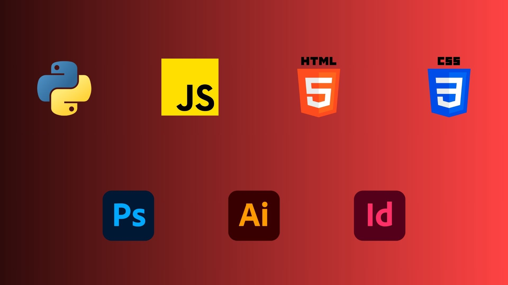

### Hello 👋, I am Stephen

I am a full-stack developer looking to change the world, one line of code at a time.  I am finishing my Bacheleors degree in Graphic Information Technology and work on projects to learn and for fun!

<!--
**stevec713/stevec713** is a ✨ _special_ ✨ repository because its `README.md` (this file) appears on your GitHub profile.

Here are some ideas to get you started:

- 🔭 I’m currently working on ...
- 🌱 I’m currently learning ...
- 👯 I’m looking to collaborate on ...
- 🤔 I’m looking for help with ...
- 💬 Ask me about ...
- 📫 How to reach me: ...
- 😄 Pronouns: ...
- ⚡ Fun fact: ...
-->
